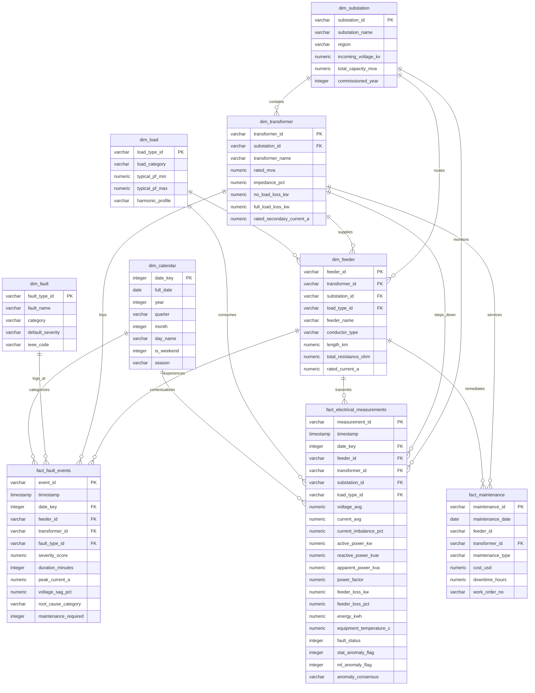

# System Architecture: Power Distribution Loss & Fault Analytics

This document details the end-to-end electrical, software, and data architectures of the system.

---

## 1. End-to-End Data Pipeline Architecture

```mermaid
flowchart TD
    subgraph Data_Sources["1. Telemetry Ingestion (Field SCADA & AMI)"]
        S1["33/11 kV Substation RTU<br>(North & South Substations)"]
        S2["Feeder Circuit Breakers & Relays<br>(IEEE 50/51/27/59)"]
        S3["Transformer Monitoring Units<br>(MVA, Oil/Winding Temp)"]
    end

    subgraph Data_Quality["2. Data Quality & Physics Engine"]
        DQ1["Boundary & Range Validator<br>(V ∈ [8k, 14.5kV], I ≥ 0, PF ∈ [0.5, 1.0])"]
        DQ2["Deduplication & Primary Key Audit"]
        DQ3["Physics Consistency Auditor<br>(P ≤ S = √3·V·I)"]
        DQ4["Data Quality Scorecard<br>(Defect Rate & Cleanliness Score)"]
    end

    subgraph Feature_Engineering["3. Electrical Feature Engineering"]
        FE1["IEEE Std 1159 Voltage Deviation Bands"]
        FE2["IEEE Std 141 Current Imbalance %"]
        FE3["Technical Conductor Loss Engine (I²R)"]
        FE4["Rolling 24h Statistical Volatility"]
        FE5["Commercial PF Penalty Exposure Flags"]
    end

    subgraph Anomaly_ML["4. Dual Anomaly Detection & ML"]
        AD1["Statistical Engine<br>(Feeder Z-Scores & Causal Attribution)"]
        AD2["Machine Learning Engine<br>(Multivariate Isolation Forest)"]
        AD3["Consensus Classification<br>(High-Confidence Dual Anomaly)"]
        AD4["Fault Predictive Classifier<br>(Random Forest Forward Risk Horizon)"]
    end

    subgraph Storage_Serving["5. Relational Star Schema & Storage"]
        DB[("SQLite / PostgreSQL<br>power_distribution.db<br>(Indexes on Feeder, Time, TR)")]
        CSV["Power BI Export Store<br>(Clean Fact & Dimension CSVs)"]
    end

    subgraph Presentation["6. Presentation & Operational Decision Support"]
        DASH["Streamlit & Plotly SCADA Dashboard<br>(Power BI Dark Executive Theme)"]
        SQL["25 Analytical SQL Query Suite<br>(Window Functions, CTEs, Rankings)"]
        REC["Rule-Based Engineering Recommendation Engine"]
    end

    Data_Sources --> Data_Quality
    Data_Quality --> Feature_Engineering
    Feature_Engineering --> Anomaly_ML
    Anomaly_ML --> Storage_Serving
    Storage_Serving --> Presentation
```



---

## 2. Relational Database Star Schema (Entity-Relationship Diagram)



---

## 3. Physical Distribution Network Hierarchy

```text
Incoming 33 kV Utility Grid Supply
  ├── Main Substation 1: SUB_NORTH (20 MVA, Double Bus)
  │     ├── Transformer TR_01 (10 MVA, 11 kV, 525 A)
  │     │     ├── FDR_01: Automotive Machining (ACSR Dog, 3.2 km, R=0.893 Ω)
  │     │     ├── FDR_02: Heavy Pumping Station (XLPE 185 mm², 2.5 km, R=0.400 Ω)
  │     │     └── FDR_03: Residential Township (ACSR Rabbit, 4.0 km, R=2.180 Ω)
  │     └── Transformer TR_02 (10 MVA, 11 kV, 525 A)
  │           ├── FDR_04: Commercial Tech Park (XLPE 240 mm², 1.8 km, R=0.225 Ω)
  │           ├── FDR_05: Water Treatment & Lighting (ACSR Dog, 5.2 km, R=1.452 Ω)
  │           └── FDR_06: Suburban Periphery Mixed (ACSR Rabbit, 6.8 km, R=3.705 Ω)
  └── Main Substation 2: SUB_SOUTH (30 MVA, Main & Transfer Bus)
        ├── Transformer TR_03 (12.5 MVA, 11 kV, 656 A)
        │     ├── FDR_07: Steel Rolling & Arc Furnace (Copper 300 mm², 2.2 km, R=0.180 Ω)
        │     └── FDR_08: Petrochemical Continuous Plant (XLPE 185 mm², 3.0 km, R=0.480 Ω)
        ├── Transformer TR_04 (12.5 MVA, 11 kV, 656 A)
        │     ├── FDR_09: Harbor Cold Storage (ACSR Dog, 3.6 km, R=1.005 Ω)
        │     ├── FDR_10: Auxiliary Utility (XLPE 150 mm², 1.6 km, R=0.330 Ω)
        │     └── FDR_11: Regional Hospital Critical (Dual XLPE 240 mm², 2.1 km, R=0.131 Ω)
        └── Transformer TR_05 (5.0 MVA, 11 kV, 262 A)
              └── FDR_12: Rural Agricultural Irrigation (ACSR Weasel, 8.5 km, R=7.735 Ω)
```
